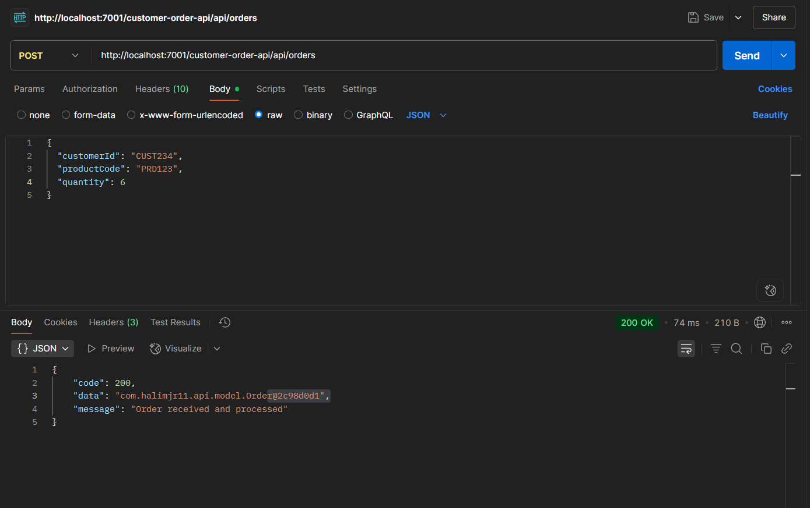
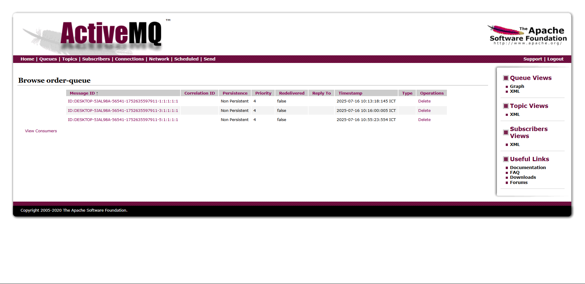
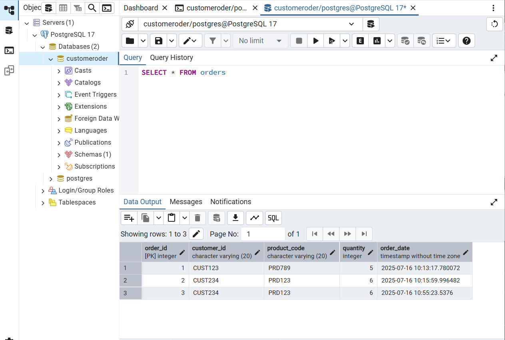

# Customer Order API

A simple RESTful API for managing customer orders using Java, PostgreSQL, ActiveMQ, and WebLogic.  
This project was developed as a **challenge** to check my understanding of Java EE development, WebLogic configuration, database integration via JNDI, and message queue implementation using ActiveMQ.

## Features

- Submit customer orders via POST endpoint
- Store orders in a PostgreSQL database
- Send order messages to an ActiveMQ queue
- JNDI-based database connection lookup
- WAR-deployable to WebLogic Server

## Tech Stack

- Java (JAX-RS)
- PostgreSQL
- ActiveMQ
- WebLogic Server
- Gradle
- JMS + JNDI

## Setup

1. **Clone the repository**
   ```bash
   git clone https://github.com/your-username/customer_order_api.git
   cd customer_order_api
   gradle clean build
   ```

## Evidence

Below is a screenshot showing a successful order being created and processed:




